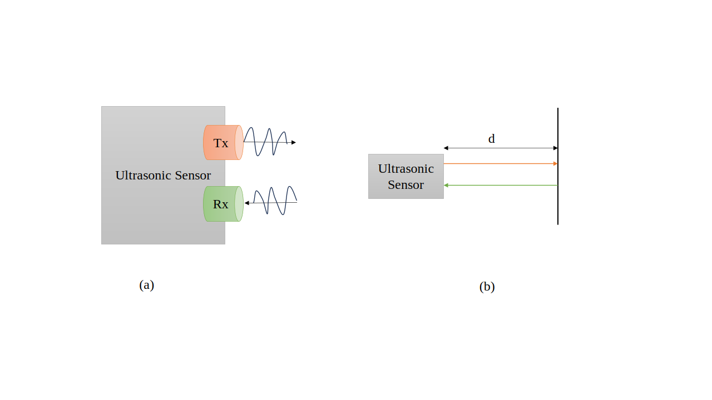

**Ultrasonic Sensor based Parking Assist System**

- The entire system is based on the Tiva C series TM4C123G LaunchPad series evaluation kit. 
- Using ultrasonic sensors, we can measure the distance between two points. This is done as shown in the figure below.
 

