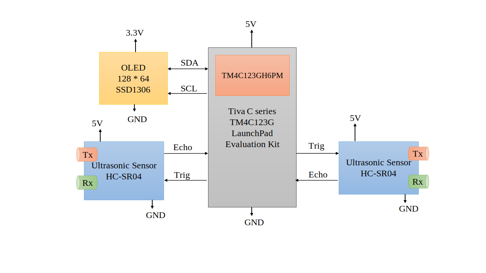

# Ultrasonic Sensor-Based Parking Assist System

**Course:** EE 615 Embedded Systems Lab  
**Group 02 Members:**  
1. Ganesh Panduranga Karamsetty - 210020009  
2. Rishabh Pomaje - 210020036  

---
### Project Plan

- Use the **TI TM4C123GH6PM microcontroller** to read and operate two ultrasonic sensors.
- Output the distance readings to the PC via serial UART.
- Blink an onboard LED at a frequency inversely proportional to the distance to the obstacle.
- We will be simultaneously using two sensors, corresponding to the front and rear sensors in a car.
---

## Project Description

This system is based on the **Tiva C series TM4C123G LaunchPad** evaluation kit. Using ultrasonic sensors, we can measure distances to detect obstacles.

### Overview of Ultrasonic Sensor (US)

An ultrasonic sensor board, as shown in Figure 1a, consists of a **Transmitter** and a **Receiver**:

- **Transmitter:** Sends an ultrasonic pulse of short duration.
- **Pulse Reflection:** The pulse travels until it encounters an obstacle and reflects back.
- **Receiver:** Waits for the reflected pulse.

The board interfaces with the microcontroller using two signal pins, `Trig` and `Echo`.

### Distance Measurement

1. Send a signal and start the timer.
2. Wait for the reflected signal.
3. Once received, check the elapsed time.
4. Calculate the distance using the formula:

    $$\text{distance} (d) = \text{speed} (s) \times \text{time elapsed} (t)$$

   where  
   -  $d$ is the distance traversed by the pulse (i.e., twice the required distance).
   - $s$ is the speed of sound, approximately 343 m/s at $20^\degree$.

5. This yields the required distance.

## System Block Diagrams

### Hardware Block Diagram

### Software Block Diagram

---

## Materials and Datasheets

| Material | Link to Datasheet |
|----------|-------------------| 
|Tiva C series TM4C123G LaunchPad | [TM4C123GH6PM Datasheet](https://www.ti.com/product/TM4C123GH6PM) |
| HC-SR04 | [HC-SR04 User Manual](https://robu.in/wp-content/uploads/2014/08/edited_HC-SR04-User-Manual-1.pdf)      |

---

## Timeline

| Date       | Milestone                |
|------------|--------------------------|
| 29/10/2024 | Initial plan formulation |
| 12/11/2024 | Able to detect and sense the distance using one US. |
| Upcoming   | Calibration of the distance |
| Upcoming   | Outputting the distance to PC monitor through UART serial|
| Upcoming   | Integrate another sensor for the front | 

